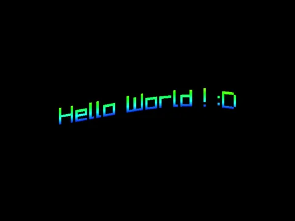
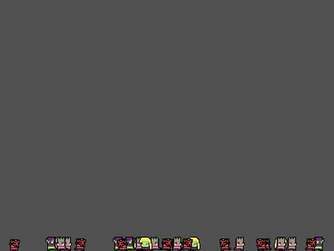
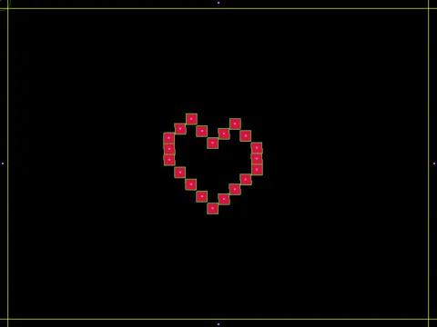
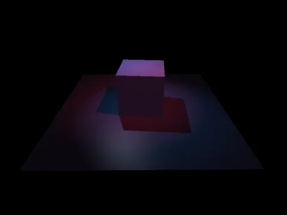
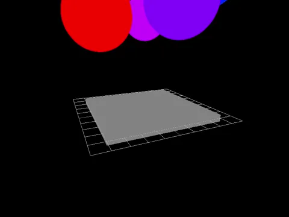

# rayFlex

**rayFlex** is like a C++ extension for [**raylib**](https://www.raylib.com/), providing a collection of modular components to simplify game and application development. The project consists of various optional modules, each offering distinct features such as 2D/3D sprite animations, 2D particle systems, advanced 3D camera, 3D lighting with shadow mapping, 2D physics with Box2D, 3D physics with Bullet3, and a networking module with automatic asymmetric encryption.

This is simply a selection of things that I have written for my personal use with raylib, primarily for educational purposes, and that I considered could be useful to others, hence its sharing today.

## Table of Contents

- 🛠️ [Installation](#installation)
- 🚀 [Getting Started](#getting-started)
- 🧰 [Core Module](#core-module)
- 🎨 [2D Graphics Module](#2d-graphics-module)
- 😎 [3D Graphics Module](#3d-graphics-module)
- ⚙️ [2D Physics Module](#2d-physics-module)
- ⚙️ [3D Physics Module](#3d-graphics-module)
- 🌐 [Networking Module](#networking-module)

## Installation

To integrate rayFlex into your CMake project, follow these steps:

1. Clone the rayFlex repository with all submodules:

```bash
git clone --recursive https://github.com/Bigfoot71/rayFlex.git
```

This command includes the `--recursive` flag, which ensures that all submodules, including optional ones, are cloned along with the main repository.

2. Configure your CMakeLists.txt file by adding the following lines:

```cmake
add_subdirectory(rayFlex)
target_link_libraries(your_project_name PRIVATE rayflex)
```

3. When configuring your project with CMake, use the following options to enable or disable specific modules:

```bash
cmake -DSUPPORT_GFX_2D=ON -DSUPPORT_PHYS_2D=ON -DSUPPORT_NET=ON ..
```

Adjust the options according to your project requirements.

### Cloning Submodules Manually

If you have already cloned the rayFlex repository without the `--recursive` flag or if you need to update the submodules later, follow these steps:

```bash
cd rayFlex
git submodule update --init --recursive
```

This ensures that all submodules are initialized and updated accordingly.

### Cloning Specific Submodules

If you only need specific submodules, you can clone only those you require. After cloning the main repository, navigate to the rayFlex directory and clone the desired submodules:

```bash
cd rayFlex
git submodule update --init --recursive external/box2d
git submodule update --init --recursive external/bullet3
git submodule update --init --recursive external/asio
git submodule update --init --recursive external/libsodium
```

Adjust the commands based on the specific submodules you need for your project.

### Note
Please note that the submodules `external/raylib` and `external/raylib-cpp` are essential for the proper functioning of the project and are therefore not optional.

## Getting Started

To integrate rayFlex into your project effortlessly, include the main header file:

```cpp
#include <rayflex.hpp>
```

Now, you can start leveraging the features provided by rayFlex in your application.

## Core Module

The core module serves as the foundation for managing scenes, transitions, resources, and window scaling through the `core::App` class. Additionally, it provides a convenient class for the generation of random data. To utilize the entire core module, include the following headers:

```cpp
#include "core/rfApp.hpp"
#include "core/rfRandom.hpp"
#include "core/rfRenderer.hpp"
#include "core/rfSaveManager.hpp"
#include "core/rfAssetManager.hpp"
```

However, including these headers independently is optional. You can directly include `rayflex.hpp` to access all activated modules configured during the CMake project setup.

These headers allow you to harness the full power of the core module, providing access to various functionalities such as scene management, transition handling, resource management, window scaling, random data generation, and more.

For detailed information about components and modules, explore the headers which contain comprehensive documentation for each function and class member.

## 2D Graphics Module

The 2D graphics module introduces basic features such as particle systems and sprites:

```cpp
#include "gfx2d/rfParticles.hpp"
#include "gfx2d/rfSprite.hpp"
```

## 3D Graphics Module

For advanced 3D graphics capabilities, including camera management and dynamic lighting with shadows:

```cpp
#include "gfx3d/rfCamera.hpp"
#include "gfx3d/rfLights.hpp"
#include "gfx3d/rfSprite.hpp"
```

## 2D Physics Module

The 2D physics module, powered by Box2D, facilitates the integration of physics functionality into your project:

```cpp
#include "phys2d/rfPhysics.hpp"
```

## 3D Physics Module

For projects requiring 3D physics features utilizing Bullet3:

```cpp
#include "phys3d/rfModel.hpp"
#include "phys3d/rfObject.hpp"
#include "phys3d/rfWorld.hpp"
```

## Networking Module

For everything related to the network (server/client) with automatic asymmetric encryption management:

```cpp
#include "net/rfClientInterface.hpp"
#include "net/rfConnection.hpp"
#include "net/rfPacket.hpp"
#include "net/rfSecurity.hpp"
#include "net/rfServerInterface.hpp"
#include "net/rfTSQueue.hpp"
```

## Example Showcase

Explore the capabilities of rayFlex with these illustrative GIFs:







